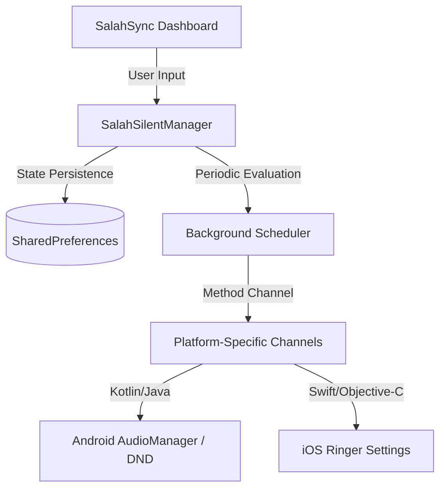

# 🕌 SalahSync

[](https://flutter.dev)
[](https://flutter.dev)
[](https://pfaaworkin01.github.io/SalahSync/)
[](https://m3.material.io/)
[](LICENSE)


**SalahSync** is a premium, intelligent mobile application built using Flutter that automatically manages your device's sound profile during congregational Salah and Jamaat periods. By bridging Flutter's core framework with native platform channels, SalahSync ensures that your device switches silently into the background during prayer and seamlessly restores your original sound settings immediately after.

---

## 🌟 Key Features

*   **Intelligent Auto-Silence Scheduler:** Pre-mute offset (0-15 minutes before) and custom silence durations (5-60 minutes) mapped individually to the five daily prayers (Fajr, Dhuhr, Asr, Maghrib, Isha) and Jumu'ah.
*   **Aesthetic Material 3 Dashboard:** Premium dark/light themes designed with curated HSL color schemes (Emerald Teal, Warm Gold, and Deep Navy backgrounds), rounded glassmorphic cards, and smooth micro-animations.
*   **Smart Sound State Restoration:** Automatically caches the device's ringer status (normal, vibrate, or silent) *prior* to a mute event and restores it precisely when the period ends.
*   **Quick Mute (Manual Override):** A one-click quick-mute feature that allows users to silence their device for a custom duration (e.g., 15, 30, 45, 60 minutes) outside regular scheduler hours.
*   **Interactive Simulation Dashboard (Time Accelerator):** Built-in time accelerator tool (60x speed multiplier) letting developers and testers fast-forward time to watch active overrides engage, tick down, and restore in seconds.
*   **Live Audit Log:** A persistent console directly on the dashboard tracking all background schedule evaluations, permission checks, and volume state transitions.

---

## 📸 Interface Design

The app is built to feel exceptionally modern and interactive, featuring:
*   **Dynamic Pulsing Badge:** A glowing amber/green radar animation that indicates when your phone is currently silenced.
*   **Interactive Action Cards:** Visual representation of each prayer schedule with slide toggles and inline configuration sheets.
*   **System Permissions Guard:** Inline warning blocks that guide Android users to grant the mandatory "Do Not Disturb" (Notification Policy Access) permission.

---

## 🛠️ Technical Architecture



### Native Android Bridge
To bypass security limitations introduced in Android 6.0 (API 23) and above, SalahSync communicates directly with native APIs using Kotlin method channels:
*   **`getSoundMode`**: Reads the system ringer status (`RINGER_MODE_NORMAL`, `RINGER_MODE_VIBRATE`, `RINGER_MODE_SILENT`).
*   **`setSoundMode`**: Requests system ringer mode toggles securely.
*   **`hasNotificationPolicyAccess`**: Checks if the application has been granted access to override "Do Not Disturb" rules.
*   **`openNotificationPolicySettings`**: Redirects the user directly to Android's system permissions window if policy access is missing.

---

## 📂 Project Structure

```
salahsync/
├── android/                  # Native Android configuration & Kotlin integration
│   └── app/src/main/kotlin/  # Native Sound Mode MethodChannels (MainActivity.kt)
├── ios/                      # Native iOS setup & frameworks
├── lib/
│   ├── main.dart             # Materials 3 UI, Dashboard components, & Themes
│   └── salah_silent_manager.dart # Scheduler engine, simulation tools & SharedPreferences
├── pubspec.yaml              # App dependencies (intl, shared_preferences, etc.)
└── README.md                 # Project documentation
```

---

## 🚀 Getting Started

Follow these steps to run SalahSync on your local development machine:

### Prerequisites
*   [Flutter SDK](https://docs.flutter.dev/get-started/install) (version `>= 3.12.2` recommended)
*   [Android Studio / Xcode](https://docs.flutter.dev/get-started/install) for emulator setups

### Installation & Run

1.  **Clone the repository:**
    ```bash
    git clone https://github.com/<your-username>/salahsync.git
    cd salahsync
    ```

2.  **Fetch dependencies:**
    ```bash
    flutter pub get
    ```

3.  **Run the project on a connected device:**
    ```bash
    flutter run
    ```

---

## 🔒 Security & Privacy

*   **Offline First:** SalahSync stores all configuration data and audit logs locally on the device using encrypted Shared Preferences. No user data, location details, or sound profiles are uploaded to external cloud endpoints.
*   **Minimal Permissions:** Only requires Do Not Disturb (Notification Policy) access on Android to safely manage the ringer. No intrusive background tracing, internet, or contacts permissions required.

---

## 📄 License

This project is licensed under the MIT License - see the [LICENSE](LICENSE) file for details.
